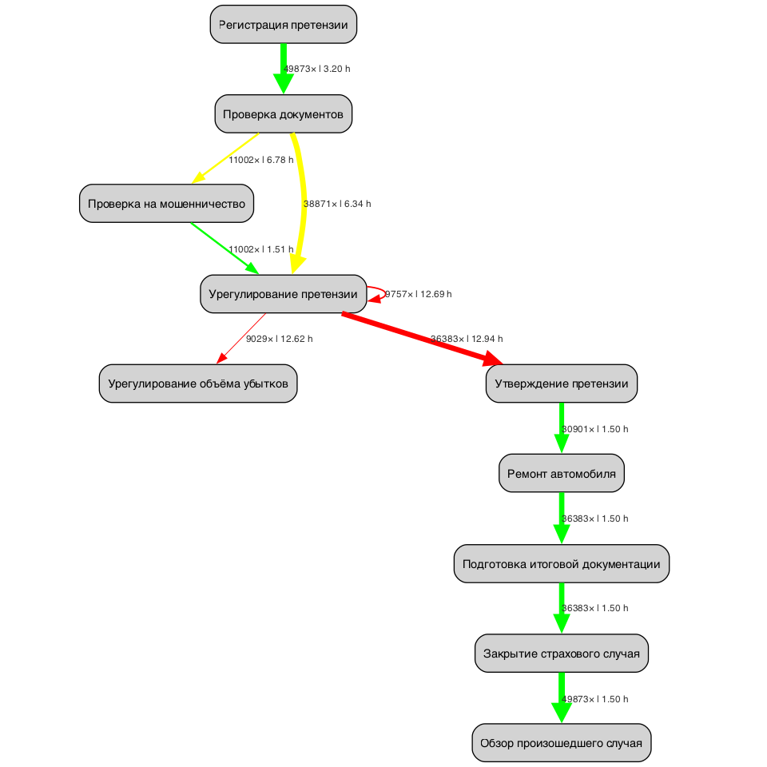

# 📊 Описание генерируемых файлов

## 📈 Графики (в текущей директории)

### `dfg_combined.png`

**Назначение**: Визуализация графа процесса с метриками частоты и производительности
**Содержание**: 
- Узлы: события процесса (размер и цвет по частоте)
- Рёбра: переходы между событиями (толщина по частоте, цвет по времени)
- Метки: количество переходов и среднее время выполнения

## 📁 CSV-файлы (в папке `tables/`)

### `bottlenecks_edges.csv`
**Назначение**: Анализ узких мест процесса  
**Структура**:
- `src` - исходное событие
- `dst` - целевое событие  
- `count` - количество переходов между событиями
- `avg_s` - среднее время перехода (секунды)
- `p50_s` - медианное время перехода (50-й перцентиль)
- `p90_s` - 90-й перцентиль времени перехода (ключевой показатель)
- `max_s` - максимальное время перехода

### `rare_costly_edges.csv`
**Назначение**: Редкие, но дорогостоящие переходы  
**Структура**: Та же, что и в bottlenecks_edges.csv, плюс:
- `ratio` - доля переходов от общего количества
**Фильтрация**: переходы с долей <2% и временем >1 часа

### `cases_durations.csv`
**Назначение**: Статистика длительности полных кейсов  
**Структура**:
- `case_duration_s` - длительность кейса в секундах
- `case_duration_h` - длительность кейса в часах

### `variants_top.csv`
**Назначение**: Топ вариантов выполнения процесса  
**Структура**:
- `variant` - последовательность событий (A→B→C)
- `count` - количество кейсов с таким вариантом

### `variants_slow_top.csv` и `variants_fast_top.csv`
**Назначение**: Самые медленные и быстрые варианты выполнения  
**Критерии**: 
- Медленные: длительность ≥ 90-го перцентиля
- Быстрые: длительность ≤ 50-го перцентиля

### `rework_by_case.csv`
**Назначение**: Анализ повторной работы (rework)  
**Структура**:
- `case_id` - идентификатор кейса
- `adjacent_repeats` - количество последовательных повторений событий
- `loops` - количество событий, которые повторяются в кейсе

### `repeated_same_activity.csv`
**Назначение**: Повторы одинаковых событий подряд  
**Структура**:
- `src`, `dst` - одинаковые события (A→A)
- `count` - количество таких повторений

### `duration_trend_by_month.csv`
**Назначение**: Тренд длительности процессов по месяцам  
**Структура**:
- `month` - месяц анализа
- `count` - количество кейсов
- `median` - медианная длительность
- `mean` - средняя длительность  
- `max` - максимальная длительность

### `sla_breaches.csv` (генерируется при наличии --sla)
**Назначение**: Нарушения SLA для заданных переходов  
**Структура**:
- `src`, `dst` - переход между событиями
- `count` - общее количество переходов
- `breaches` - количество нарушений SLA
- `breach_rate` - доля нарушений
- `p90_s` - 90-й перцентиль времени перехода

### `edges_sla_template.csv` (генерируется без --sla)
**Назначение**: Шаблон для настройки SLA правил
**Использование**: Добавить столбец `sla_s` с лимитами времени и перезапустить скрипт с --sla

## �� Выявленные уязвимости (на основе текущего датасета)

1) Зацикливание на этапе `Урегулирование претензии` (self-loop)
   - Частота: 9 757 переходов A→A (`repeated_same_activity.csv`).
   - Риск: повторная работа и задержки перед передачей на утверждение.

2) Узкое место: `Урегулирование претензии → Утверждение претензии`
   - p90: ~82 800 с (≈23 ч) (`bottlenecks_edges.csv`).
   - Влияет на основной поток, часто подсвечивается как bottleneck на графе.

3) Долгие ответы в ветке отказа: `Урегулирование претензии → Отклонение претензии`
   - p90: ~82 800 с, среднее ~45 299 с (≈12,6 ч), count: 4 461.
   - Риск: затягивание негативного исхода, рост недовольства клиентов.

4) Потери документов: `Проверка документов ↔ Поиск потерянной документации`
   - Есть туда-обратно и повторные переходы; p90 каждого направления ~43 200–54 000 с.
   - Риск «пинг‑понга» и ручной работы, указывает на слабые места в документообороте.

5) Сезонные колебания длительности незначительны, но пиковые значения растут
   - Медиана по месяцам стабильна ~118,8–119,1 тыс. с, но `max` доходит до 410 400 с в пике (`duration_trend_by_month.csv`).
   - Риск: отдельные кейсы «зависают» в пиковые периоды.

6) Значимая доля кейсов идёт по медленным вариантам
   - Быстрые топ‑варианты: 24 989 кейсов; медленные топ‑варианты: 5 157 кейсов.
   - Риск: значимая нагрузка на SLA и ресурсы в «медленном хвосте».

7) Длительность кейсов: тяжёлый хвост
   - Медиана: ~118 920 с (≈33 ч), p90: ~169 200 с (≈47 ч), p99: ~277 620 с (≈77 ч), максимум: 410 400 с (≈114 ч) (`cases_durations.csv`).
   - Риск: высокие ожидания и эскалации в хвосте распределения.

8) Дополнительная повторная работа перед закрытием
   - Наличие повторов и возвратов перед `Закрытие страхового случая` в медленных вариантах (`variants_slow_top.csv`).
   - Риск: неустойчивость стандарта и ручные обходы.

9) Потенциальные превышения внутренних нормативов (SLA) по отдельным переходам
   - В текущем шаблоне SLA пиковых нарушений нет (по сопоставлению p90 и SLA),
     но близость p90 к лимитам у переходов из п.2–4 требует контроля.

### Рекомендации действий (как у практикующего процесс‑аналитика)
- Стандартизировать обработку на цепочке `Проверка документов ↔ Поиск потерянной документации`:
  чек‑листы, автоматические напоминания, контроль полноты.
- Ввести WIP‑лимит и SLA‑контроль на `Урегулирование претензии` и hand‑off к `Утверждение претензии`.
- Для петель (A→A) — правила эскалации и чек‑пойнты качества, чтобы исключить повторные доработки.
- Разделить потоки: «стандартный», «рисковый/мошенничество», «неполные документы» — с разной политикой приоритизации.
- Пересмотреть список «медленных» вариантов и провести таргетные улучшения по 3–5 самым частым.
- Уточнить `edges_sla_template.csv` под реальные нормативы и включить регулярный мониторинг p90.

## �� Дашборд (Streamlit)

Установка и запуск локально:

```bash
/opt/anaconda3/bin/python -m pip install streamlit | cat
/opt/anaconda3/bin/streamlit run /Users/anna/Documents/r2/PM_CASE_CH/dashboard.py --server.headless true --server.port 8501
```

После запуска откройте в браузере: `http://localhost:8501`.

Дашборд читает CSV из папки `tables/` и отображает:
- KPI по стадиям, Handoff/«пинг‑понг», SLA‑нарушения
- Возвраты/редкие/ручные шаги, аномалии, варианты, коорт‑тренды
- Вкладку «DFG» с интерактивным графом процесса (`dfg_combined.html`)

## 🧭 Категории узких мест и визуализации

Ниже — типы неэффективностей, обнаруживаемые в датасете, и соответствующие артефакты.

- Частотные:
  - Петли A→A — `tables/repeated_same_activity.csv`, график: `figs/loops_top.png`
  - Редкие этапы — `tables/rare_activities.csv`, график: `figs/rare_steps.png`
  - Воронка по топ‑варианту — `tables/funnel.csv`, график: `figs/funnel_conversion.png`
- Временные:
  - Узкие места по p90 — `tables/bottlenecks_edges.csv`, график: `figs/bottlenecks_p90.png`
  - Ступени с высоким p90 — `tables/stage_kpi.csv`, график: `figs/stages_p90.png`
  - Тренд медианы — `tables/duration_trend_by_month.csv` или `tables/cohort_trends.csv`, график: `figs/trend_median_month.png`
- С последовательностью:
  - Возвраты к пройденным шагам — `tables/returns.csv`, график: `figs/returns.png`
  - Возврат к старту — `tables/return_to_start.csv`, график: `figs/return_to_start.png`
  - Вне эталонного пути — `tables/off_golden_edges.csv`, график: `figs/off_golden.png`
- Сотрудники:
  - Передачи между исполнителями — `tables/handoff_matrix.csv`, график: `figs/handoff_top.png`
  - Нагрузка по событиям — `tables/worker_load.csv`, график: `figs/worker_load.png`
  - Среднее время перехода — `tables/worker_transition_time.csv`, график: `figs/worker_time.png`
- Ручные/авто операции:
  - Ручные каналы — `tables/manual_steps.csv`, график: `figs/manual_channels.png`
  - Отсутствие исполнителя — `tables/manual_steps.csv`, график: `figs/worker_missing.png`

Перегенерация данных и графиков:

```bash
/opt/anaconda3/bin/python /Users/anna/Documents/r2/PM_CASE_CH/process_report.py \
  -i /Users/anna/Documents/r2/PM_CASE_CH/case_championship_last.csv \
  -o /Users/anna/Documents/r2/PM_CASE_CH/dfg_combined.png \
  --case-col ID --activity-col Событие --timestamp-col Время \
  --rankdir TB --min-freq 1 \
  --sla-csv /Users/anna/Documents/r2/PM_CASE_CH/tables/edges_sla_template.csv \
  --top-variant-csv /Users/anna/Documents/r2/PM_CASE_CH/tables/variants_top.csv \
  --tables-dir /Users/anna/Documents/r2/PM_CASE_CH/tables \
  --figs-dir /Users/anna/Documents/r2/PM_CASE_CH/figs
```

Готовые картинки лежат в `figs/`. Их можно вставлять в презентации/отчёты.